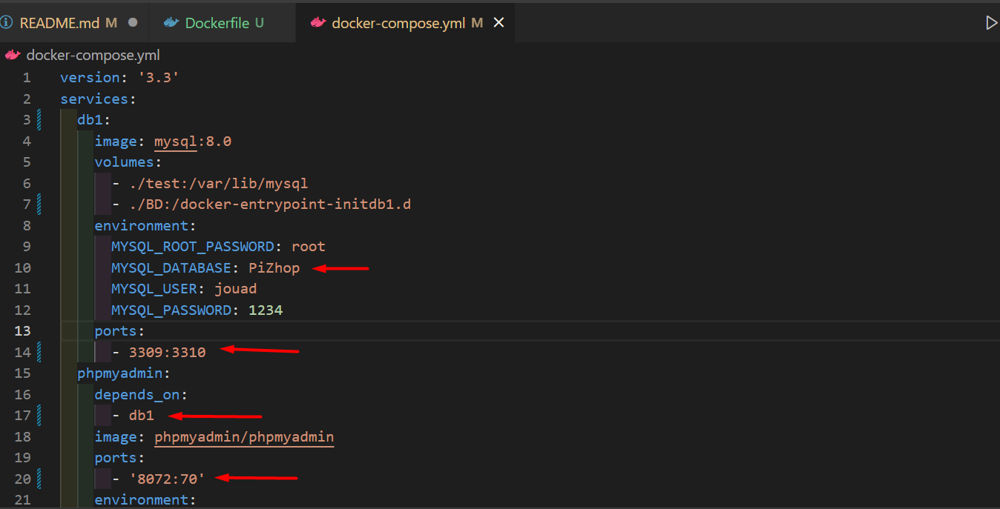
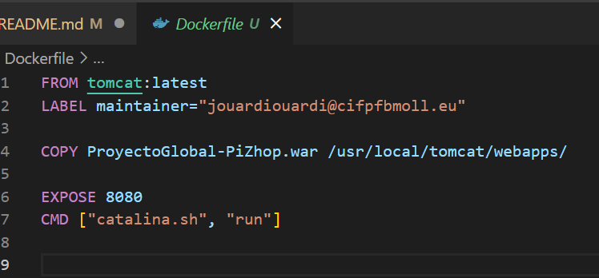
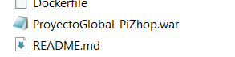
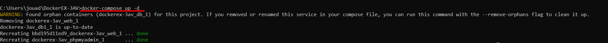
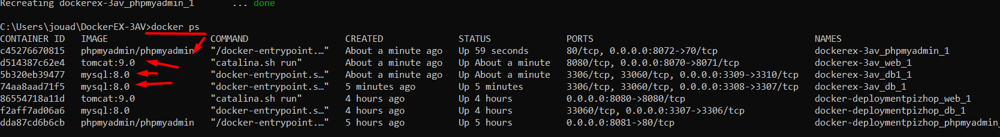
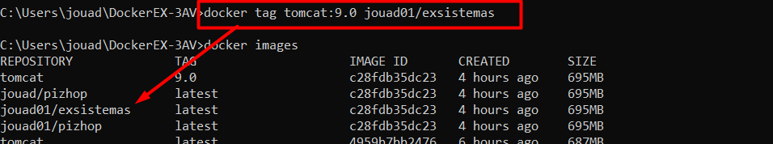
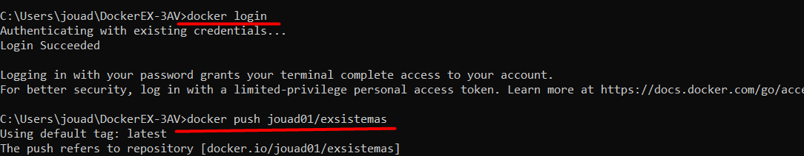
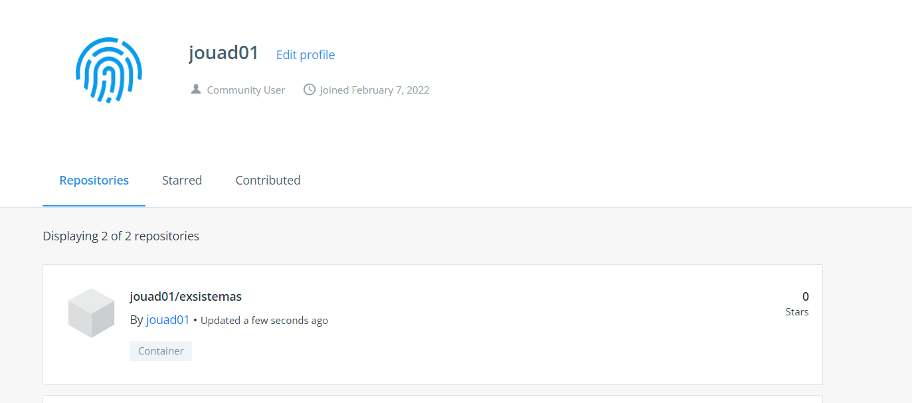

# DockerEX-3AV

## Tabla de contenidos
1. [Introducción](#Introduccion)
1. [Configuración del archivo](#Configuracion-del-archivo)
1. [Despliegue de la aplicacion](#Despliegue-de-la-aplicacion)
1. [Imagen a dockerhub](#Imagen-a-dockerhub)
1. [Conclusiones](#Conclusiones)
1. [Annexos](#Annexos)

---

## Introduccion

La premisa de la imagen de este proyecto es una aplicación que conectará una página web a la base de datos, aplicando CRUD, mediante un servidor Apache Tomcat. 

La idea de este proyecto ha concluido en una pizzería, una idea simple que cumplirá los requisitos estipulados en el proyecto. 
La pizza es un plato típico en el mundo y forma parte del vocabulario de prácticamente cualquier ciudadano de occidente además de tener presencia en innumerables otras culturas, ya sea como una variación del plato tradicional u otras variantes adaptadas a cada región. Por eso, PiZhop, será una página que permitirá a cualquier usuario pedir a domicilio dentro de una heterogénea y diversa combinación de los platos más ricos.

Por eso, PiZhop, será una página que permitirá a cualquier usuario pedir a domicilio dentro de una heterogénea y diversa combinación de los platos más ricos. Todo esto está incluido en el fichero .war.

Pero en este caso, la imagen cambia de nombre a *exsistemas*, pero antes un resumen de Docker Compose.


### Docker Compose

La herramienta Docker Compose, nos permitirá definir y ejecutar múltiples aplicaciones utilizando contenedores de software.

Con Compose utilizaremos ficheros en formato YAML, que nos servirán para definir la configuración de la aplicación en cuestión. De esta manera podemos, con un solo comando, crear e iniciar los servicios configurados en estos ficheros.

**[⬆ back to top](#tabla-de-contenidos)**

---

## Configuración del archivo

Suponiendo que tenemos Docker creado y un repositorio en marcha, lo primero y recomendable, será incluir el fichero .war, una vez hecho, creamos el fichero .yml. 
En este caso con puertos distintos, **es importante no tenerlos ya en uso**.




Lo segundo, un fichero *Dockerfile*, algo básico.



El .war incluido en el repositorio una evz lo importamos.



**[⬆ back to top](#tabla-de-contenidos)**

---

## Despliegue de la aplicacion

Antes de todo, muestra de la aplicacion y puerto en concreto.


<<<<<<< HEAD

=======
>>>>>>> 9076163 (doc: ultimos cambios)
Si todo lo hemos puesto bien, no nos debería fallar.

Nos situamos en el mismo directorio y usamos 

```docker-compose up -d```



Vemos nuestras imagenes.



**[⬆ back to top](#tabla-de-contenidos)**

---

## Imagen a dockerhub

Creamos el tag que subiremos al dockerhub.



Hacemos login con una cuenta ya creada donde nos pedirá nombre y contraseña y, finalmente, hacemos el push.



Finalmente podemos ver los push realizados, en este caso el último, que es **exsistemas**




### Enlace

*Dockerhub:* **https://hub.docker.com/u/jouad01**

**[⬆ back to top](#tabla-de-contenidos)**

---

## Conclusiones

Diferente forma de dockerizar una aplicación, esta vez web, que no se limita en un dockerfile.
El uso de una aplicación de esta envergadura no facilita la tarea, diferentes versiones de tomcat y base de datos hace que haya que andarse con ojo.
Pero en este caso (si está bien) ha sido disfrutable una vez que se le pilla el gancho, de esta forma animarse a dockerizar nuestras futuras aplicaciones será algo apetecible. 

Algo como pendiente es que tenga una comunicación eficaz con la base de datos.


**[⬆ back to top](#tabla-de-contenidos)**

---

## Annexos

- https://colaboratorio.net/davidochobits/sysadmin/2018/despliegue-de-aplicaciones-con-docker-compose/

- https://devops4solutions.com/deploy-a-tomcat-application-using-docker-compose/

- https://github.com/maximofernandezriera/loginwebapp-docker-compose

**[⬆ back to top](#tabla-de-contenidos)**
